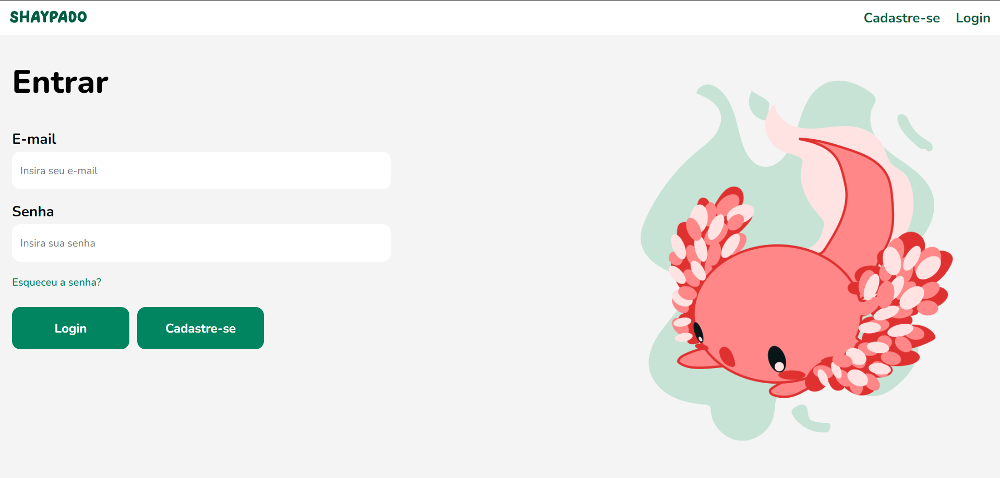
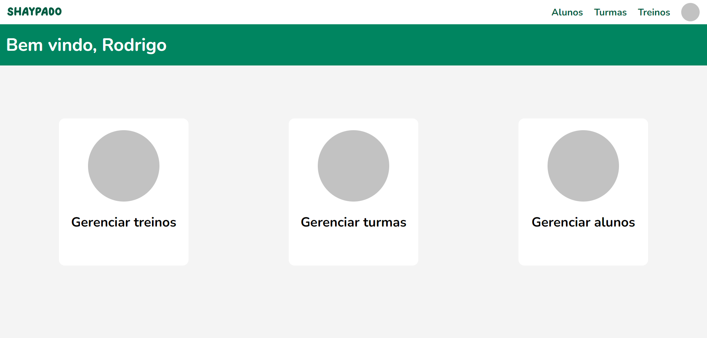

# Shaypado
O projeto Shaypado é uma iniciativa que visa proporcionar uma experiência única e motivadora para os entusiastas e iniciantes de atividades físicas. Diante da crescente preocupação com a saúde e bem-estar, o Shaypado surge como uma solução abrangente para motivar os usuários a se engajarem em exercícios e acompanharem de perto seu progresso.

A era moderna trouxe consigo um estilo de vida sedentário, contribuindo para diversos problemas de saúde. O Shaypado nasce da necessidade de combater esse padrão, incentivando as pessoas a adotarem um estilo de vida ativo, buscando construir sua própria identidade e fidelizar seus usuários. A justificativa do projeto está ancorada na promoção da saúde física, oferecendo aos usuários uma ferramenta personalizável que os mantenha motivados, conectados e comprometidos com seus objetivos fitness.

# Shaypado Web 
O Shaypado web tem como intuito disponibilizar mais ferramentas de análise e gerencimanto de: alunos, turmas e treinos; Apenas para profissionais já cadastrados no Shaypado App.

## Funcionalidades do Web

- **Gerenciar alunos:** É possível dentro da plataforma ver quais são seus alunos cadastrados; Cadastrar/Excluir alunos; Editar informações do aluno;.
- **Gerenciar treinos:** Além de ser possível criar novos treinos, também é possível designalos para certas turmas ou alunos específicos.
- **Gerenciar turmas:** Crias/Excluir turmas; Adicionar e remover alunos das turmas; Designar treinos para das turmas.
- **Métricas chaves:** Para todos os seus alunos são disponibilizados gráficos com seu desenpenho individual, frequencia de treino, melhoras corporais, entre outras métricas.
- **Vizualizar históricos:** É possível analisar também as fichar anteriores dos alunos.

## Capturas de Telas

    
    
    
    
    
    

## Project setup
Para instalar o Shaypado web você precisa de poucos passos, são eles:

1. Já ter instalado o node >= 18.17.1 [aqui](https://nodejs.org/).
2. Run `npm install` para instalar as dependências.
3. Run `npm run dev` para rodar o projeto.
4. Rodar o back do Shaypado. [Shaypado-backend](https://github.com/Projeto-Des-SW/shaypado-backend)

## Repositórios do Shaypado

1. [Shaypado-Mobile](https://github.com/Projeto-Des-SW/shaypado-mobile) - APP Mobile do Shaypado
2. [Shaypado-Web](https://github.com/Projeto-Des-SW/shaypado-web) - Este repositório
3. [Shaypado-backend](https://github.com/Projeto-Des-SW/shaypado-backend) - Backend dos projetos
3. [Shaypado-ai](https://github.com/Projeto-Des-SW/shaypado-ai) - Backend do shaypado com relação a funções de IA
